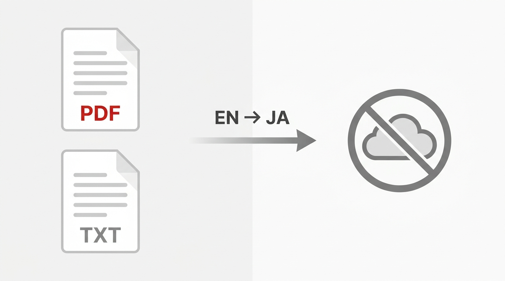

# LocalDocTranslator

LocalDocTranslator はプライバシーを重視したローカル環境で動作するドキュメント翻訳ツールです。PDF または TXT ファイルからテキストを抽出し、抽出時によく発生するノイズ（ページ番号、行番号、ハイフネーションなど）をクリーンアップします。また、[Ollama](https://ollama.com/) 経由で最適なローカルの大規模言語モデル（LLM）を自動検出し、非常に自然な日本語に翻訳します。

すべての処理はローカルで完結するため、**完全な機密性が保たれます。**

## 主な機能
- **ローカルでの PDF・テキスト処理:** データをクラウドに送信することなく抽出および翻訳を行います。
- **モデルの自動検出:** ローカルの Ollama インスタンスを自動的にチェックし、翻訳に最適な利用可能なモデル（例: `qwen2.5:14b`, `llama3.2` など）を選択します。
- **フォーマットのクリーンアップ:** ページ番号を削除し、行をまたぐハイフネーションされた単語を修正し、段落構造を維持しながら途切れた行を結合します。
- **スマートなチャンク分割:** 長いテキストを段落ごとに分割し、LLM のコンテキストウィンドウに収まるように処理した上で、自動的に全文を再構成します。

## 必須要件
- Python 3.8以上
- [Ollama](https://ollama.com/) がローカルでインストールされ、少なくとも1つのモデル（例: `ollama run qwen2.5:14b`）が実行可能であること

## インストール方法

1. このリポジトリをクローンします:
   ```bash
   git clone <YOUR_REPO_URL>
   cd LocalDocTranslator
   ```

2. 必要な Python パッケージをインストールします:
   ```bash
   pip install -r requirements.txt
   ```

3. スクリプトに実行権限を付与します:
   ```bash
   chmod +x local_document_translator.py
   ```

## 使い方

`.pdf` または `.txt` ファイルのパスを指定してスクリプトを実行します。このツールは **Windows, Mac, Linux** のすべてのOSで共通して動作します（特別な依存関係はなく標準のPython機能と `pypdf` を使用しています）。

**Mac / Linux の場合:**
```bash
./local_document_translator.py /path/to/your/document.pdf
```

**Windows の場合:**
```cmd
python local_document_translator.py C:\path\to\your\document.pdf
```

### オプション

- **`-m, --model`**: 使用する Ollama モデルを指定します。デフォルトは `auto` で、最適な利用可能なモデルが自動検出されます。
  **Mac / Linux:**
  ```bash
  ./local_document_translator.py document.pdf -m llama3.2:3b
  ```
  **Windows:**
  ```cmd
  python local_document_translator.py document.pdf -m llama3.2:3b
  ```
- **`-o, --output`**: 出力ファイルのパスを指定します。指定しない場合、`[元のファイル名]_ja.txt` として保存されます。
- **`--save-clean-text`**: 翻訳前のクリーンアップされた英語のテキストを保存します（テキスト抽出のデバッグに便利です）。
- **`--chunk-size`**: 翻訳チャンクあたりの最大文字数を調整します（デフォルト: 1500）。

## ワークフローの例
```bash
$ ./local_document_translator.py sample.pdf
最適なモデルを自動検出中...
自動検出された最適なモデル: qwen2.5:14b
PDFからテキストを抽出中: sample.pdf
抽出されたテキストをクリーンアップ中...
翻訳のためにテキストを 5 つのチャンクに分割しました（使用モデル: qwen2.5:14b）。
  チャンク 1/5 (1450 文字) を翻訳中...
  チャンク 2/5 (1300 文字) を翻訳中...
...
成功しました！翻訳全体が sample_ja.txt に保存されました
```

## おすすめのユースケース（活用シーン）

完全ローカル環境で動作するため、外部のクラウド翻訳サービス（DeepLやChatGPTなど）にデータを送信することが禁止されている以下のようなケースに最適です。

- **未発表論文の査読（Peer Review）時の参考翻訳:** 多くの学術ジャーナルや国際会議では、査読中論文のクラウドAIへの入力が機密保持の観点から禁止されています。本ツールは完全にローカルで処理されるため、機密保持規程に違反することなく論文の翻訳支援を受けることができます。
- **機密書類（NDA関連・社外秘資料）の翻訳:** 外部に漏洩してはならない契約書、未発表の特許資料、社外秘の企画書などを安全に翻訳できます。
- **個人情報・医療データの処理:** 外部サービスに送信できない顧客情報や患者データ（HIPAA等の規制対象）を含むドキュメントの翻訳。

## 免責事項 (Disclaimer)

本ソフトウェアを使用するにあたり、以下の免責事項にご同意いただいたものとみなします。

1. **翻訳の正確性の非保証:** 本ツールはLLM（大規模言語モデル）を利用して翻訳を行いますが、翻訳結果の正確性、完全性、妥当性、特定の目的への適合性について、いかなる保証も行いません。誤訳、専門用語の誤り、文脈の欠落が発生する可能性があります。出力された翻訳はあくまで「参考翻訳」として利用し、最終的な判断・確認は必ずご自身の責任で行ってください。
2. **機密性の確保に関する責任:** 本ツール自体はインターネット経由で外部のAPI等へデータを送信しない設計（完全ローカル動作）となっていますが、ご使用のPC環境自体のセキュリティ（マルウェア感染やOSの脆弱性など）に起因する情報漏洩について、開発者は一切の責任を負いません。
3. **損害の免責:** 本ツールの使用、または使用できなかったことにより生じた直接的、間接的、偶発的、特別、または派生的な損害（データの消失、業務の中断、金銭的損失、論文査読や契約に関するトラブルなどを含みますがこれらに限定されません）について、開発者は一切の責任を負いません。
4. **自己責任での利用:** 学会や所属組織の機密保持ポリシー、法令、契約等に違反しないかどうかの最終確認は、利用者ご自身の責任において行ってください。

## 連絡先

本ツールに関するお問い合わせは、以下の連絡先までお願いいたします。
- 村上 遼 (Ryo Murakami) ryo.murakami.medtech@gmail.com
